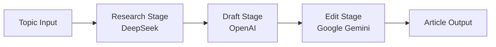

# AI Newspaper Agent 📰

[](https://github.com/PawanKonwar/ai-newspaper-agent/actions/workflows/ci.yml)

**Automates article generation through a three-stage LLM pipeline: Research → Draft → Edit.**  
Uses **multiple LLM providers**—**DeepSeek**, **OpenAI**, and **Google Gemini**—in a single workflow for research, writing, and polishing.

---

## Why This Project Exists

Manual research and drafting are slow and inconsistent. This project shows how to **orchestrate multiple LLMs** in one pipeline: DeepSeek for research, OpenAI for drafting, and Gemini for editing. It demonstrates production-style **modular AI design** and **provider-agnostic orchestration**.

---

## Architecture



**Design:** Each stage uses a dedicated LLM. Research gathers facts, Draft produces the article, Edit polishes style and length. The pipeline is modular so stages can be regenerated or swapped.

---

## Core Capabilities

- **Multi-LLM pipeline:** DeepSeek (research), OpenAI (draft), Google Gemini (edit)
- **Web UI:** Topic, word count, collapsible stage results, regenerate per stage
- **Export:** Download article as `.txt` with headline, date, and word count
- **In-browser editing** of the final article before download
- **Research transparency:** Facts with source attributions when the model follows the format

---

## Tech Stack

- **Python 3.10+**
- **LLMs:** OpenAI, DeepSeek, Google Gemini
- **LangChain** (OpenAI, Google GenAI integrations)
- **FastAPI** + Jinja2 for the web app

---

## Quick Start

```bash
git clone <repository-url>
cd ai_newspaper_agent
python3 -m venv .venv
source .venv/bin/activate   # Windows: .venv\Scripts\activate
pip install -r requirements.txt
pip install -e .
cp .env.example .env
# Edit .env and set OPENAI_API_KEY, DEEPSEEK_API_KEY, GOOGLE_API_KEY
python start.py
```

Open **http://localhost:8000**, enter a topic and word count, and run the pipeline.

---

## Example: How the Pipeline Uses Each Provider

Stages are wired in code; you choose providers via API keys in `.env`:

| Stage   | Provider   | Role                          |
|---------|------------|-------------------------------|
| Research| **DeepSeek** | Fact-finding, source-style output |
| Draft   | **OpenAI**   | Article drafting from research  |
| Edit    | **Google Gemini** | Polish, length, tone        |

To run the pipeline programmatically:

```python
from app.pipeline import NewspaperPipeline
import asyncio

pipeline = NewspaperPipeline()
result = asyncio.run(
    pipeline.run_pipeline(topic="Climate policy in 2024", max_length=500)
)
# result["research_stage"], result["draft_stage"], result["final_stage"]
```

Each stage’s LLM is configured in `app/pipeline.py`; you can change models or providers per stage there.

---

## Running Tests

```bash
pip install -e .
python -m pytest tests/ -v --tb=short
```

Tests run without API keys; missing keys cause stages to report `"skipped"` or `"error"` but tests still pass.

---

## What This Demonstrates

- **End-to-end AI pipeline design** with clear stage boundaries
- **Multi-LLM orchestration** for reliability and cost/quality tradeoffs
- **Structured outputs** (research facts, draft, edited article)
- **Production-minded setup:** FastAPI, env-based config, CI (pytest, flake8, isort)

---

## More Details

- **Environment variables, API endpoints, and CI:** see [USER_GUIDE.md](USER_GUIDE.md).
- **License:** [MIT](LICENSE).
